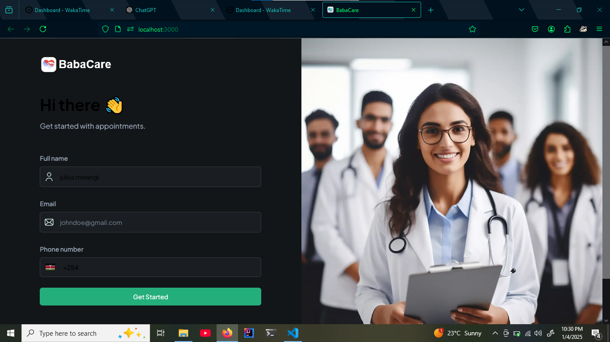

# Babacare

Babacare is a modern healthcare management system designed to streamline patient registration, medical records, and appointment scheduling. Built with cutting-edge technologies, it provides a seamless experience for both patients and healthcare providers.

## Mission
To enhance the efficiency of healthcare delivery through technology, ensuring patients receive quality care and providers can focus on what matters most.

## Key Features

- **Patient Registration**: Easily register new patients with detailed personal, medical, and identification information.
- **Medical Records Management**: Maintain accurate and up-to-date patient medical history.
- **Appointment Scheduling**: Simplify the process of booking and managing appointments.
- **Profile Image Uploads**: Allow patients to upload profile pictures securely.
- **User Authentication**: Secure login and role-based access control for providers and admins.

## Technology Stack

Babacare leverages modern web development tools and frameworks, including:

- **Frontend**: Next.js, TypeScript, TailwindCSS
- **Backend**: Node.js, Express.js
- **Database**: MongoDB
- **File Uploads**: UploadThing SDK
- **Validation**: Zod for schema validation

## Workflow

1. **Patient Registration**: Users fill out a form with personal, medical, and identification details.
2. **Data Validation**: Form inputs are validated using Zod schemas to ensure data integrity.
3. **Data Storage**: Information is securely stored in MongoDB.
4. **Appointments**: Patients can schedule appointments directly after registration.

## Future Plans

- **Integration with Telemedicine Platforms**: Enable virtual consultations.
- **Analytics Dashboard**: Provide healthcare providers with insights into patient data.
- **Multi-Language Support**: Cater to diverse user bases.
- **Mobile App Development**: Extend Babacare’s reach to mobile devices.
